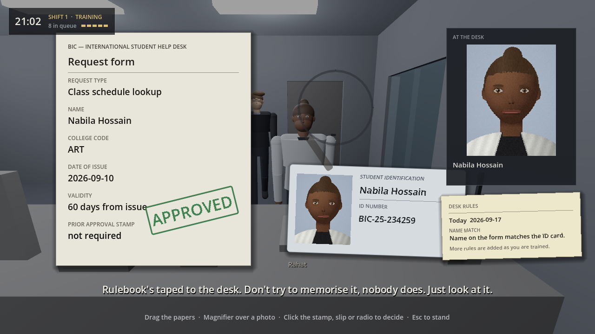
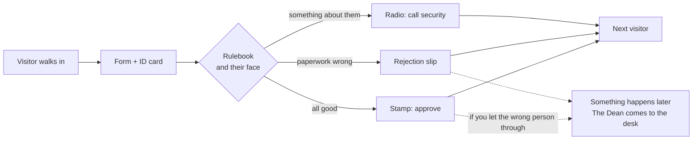
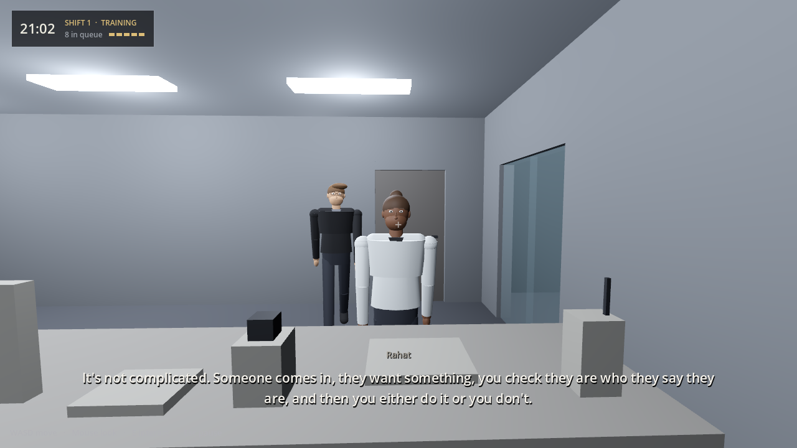
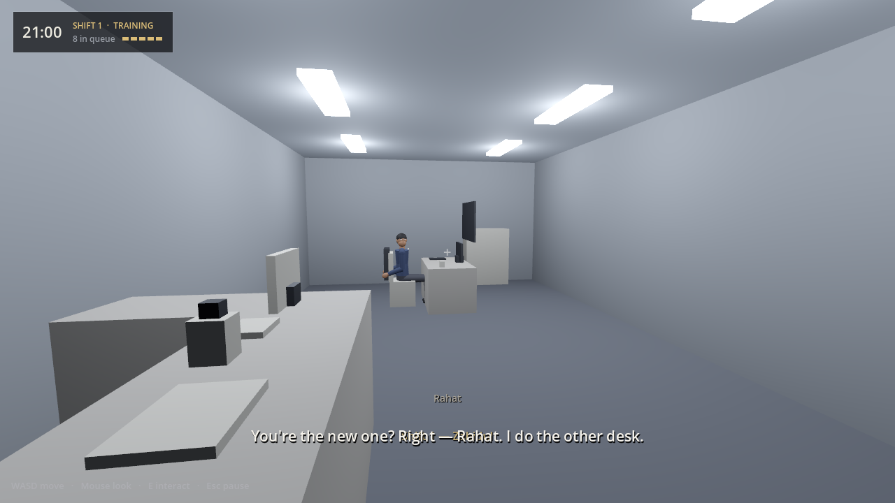
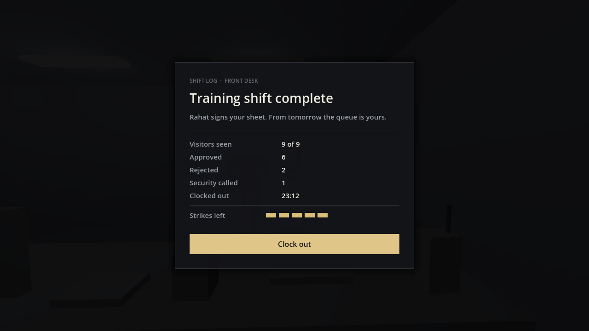
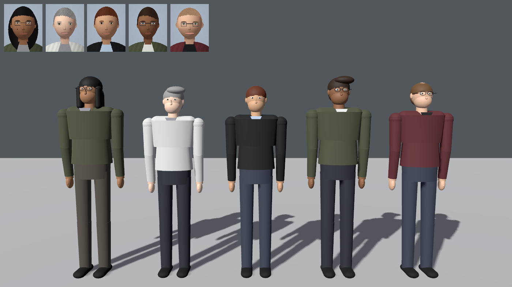
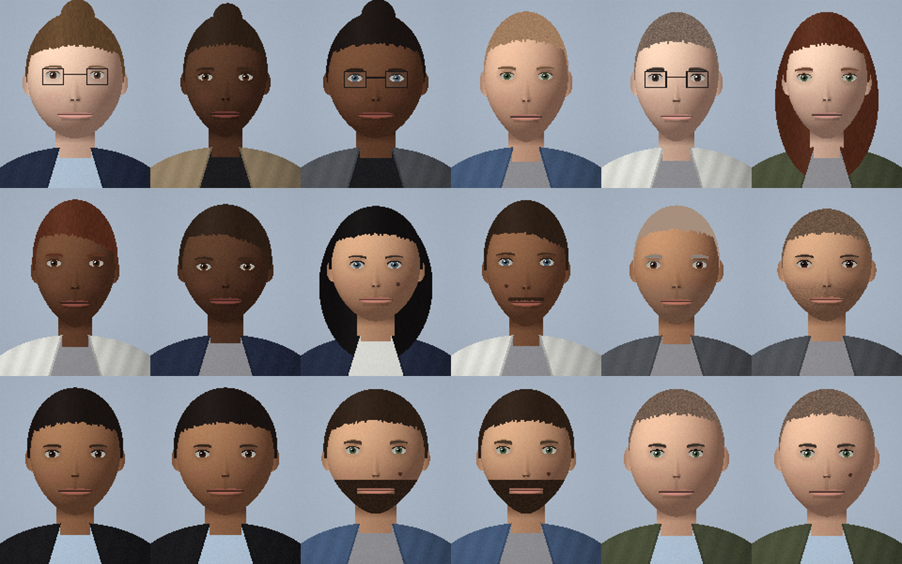

<div align="center">

# Echoes of BIC

### A realistic horror job simulator

You work the night front desk at a university's international student help desk.
Check every visitor's ID and paperwork against the rulebook, then approve, reject, or call security.
**Most people are exactly who they say they are.**



**[▶ Play in the browser](https://zahiddiff.github.io/echos-of-bic/)** · **[🎮 Controls](#controls)** · **[🗺 Roadmap](#roadmap)** · **[🧪 Help playtest](PLAYTESTING.md)**


</div>

> [!NOTE]
> **Work in progress.** The game is still being built. Expect gray-box rooms, procedural characters, placeholder sound and frequent changes. The browser build updates automatically with every change.

---

## The job

Visitors come in with ordinary requests: a class schedule, a transcript, visa paperwork, a parcel from the mailroom. You pull up their form, compare it with their ID, look closely at their face, ask a follow-up question if something feels off, and make the call.

A few of them are not who they say they are. Nothing tells you when you get one wrong. You find out later, when something happens somewhere else in the building and the Dean comes down to your desk.

No monsters, no jump scares, nothing supernatural. The dread comes from people, paperwork, and an institution that is slow to take its own warnings seriously.

| At the desk | What you do |
|---|---|
| **Read the form** | Name, college code, issue date, validity window, prior approval stamp |
| **Check the ID** | Drag the card next to the form; the number has a format, the year has a range |
| **Look at the face** | Drag the magnifier over the ID photo and over the person in front of you |
| **Ask** | One or two follow-up questions; watch how they answer, not just what they say |
| **Look it up** | A dated records terminal for enrollment and schedules |
| **Decide** | Stamp **APPROVED**, fill in a **rejection slip**, or pick up the **radio** and call security |



## Screenshots

| A visitor at the counter | The main floor |
|---|---|
|  |  |

| End of a shift | Faces that match their photos |
|---|---|
|  |  |

### ID photos
Every visitor's ID photo is generated from a face (skin, hair, eyes, glasses, facial hair, face shape), and the 3D person at the counter is built from that same face. When the photo isn't them, the difference is small on purpose: a slightly wider jaw, eyes a little further apart, a mole that shouldn't be there.


<sub>Bottom row: three faces, each next to a near-copy. Spotting which is which is the job.</sub>

## What's in the build

| Part | Status |
|---|---|
| First-person movement, the building with locked doors, name entry | ✅ Working |
| Desk: document viewer, ID card, magnifier, records terminal, subtitled dialogue with follow-ups | ✅ Working |
| Stamp, rejection slip and security radio as physical desk objects | ✅ Working |
| 20 request types, 6 rulebook rules, 4 kinds of wrong paperwork, generated queues | ✅ Working |
| Threats hidden in the queue, delayed incidents, the Dean, 5 strikes for the whole run, 3 endings | ✅ Working |
| Scripted training shift with Rahat, teaching one rule at a time | ✅ Working |
| Shift report, status bar, pause menu, desk rules sheet | ✅ Working |
| Body-language tells, shift lighting, environmental details that react to your run | ✅ Working |
| Final confrontation | 🚧 Being designed |
| Real art, voices and recorded sound | 🚧 Placeholders for now |
| Playtest logging, post-shift questions and a balance report tool | ✅ Working |
| Tuning the difficulty against real playtests | 🚧 Waiting on testers |

## Controls

| Key | Action |
|---|---|
| `W` `A` `S` `D` | Walk |
| Mouse | Look |
| `E` | Interact / sit at the desk |
| Mouse (at the desk) | Drag papers and the magnifier; click the stamp, rejection slip, radio or terminal |
| `Esc` | Stand up from the desk / pause |

## How it's built

- **Engine:** Godot 4.7, GDScript only, no plugins.
- **Generated in code:** the building, ID photos, visitor bodies and most of the UI are built procedurally, so the whole game lives as text in the repo.
- **Tests:** headless suites cover the rulebook, queue generation, the desk, dialogue, consequences, the training shift, characters, the end of a shift, the playtest log, and a balance simulation that plays hundreds of full runs.
- **Deploys itself:** every push to `main` runs the tests on GitHub Actions and, if they pass, exports the web build to GitHub Pages.

```
code/
├─ autoload/   run state: name, shift, strikes, endings
├─ data/       rulebook, task pool, visitor requests, queue and dialogue generation
├─ desk/       document viewer, magnifier, stamp, slip, radio, terminal, ID photos
├─ game/       shift runner, judging decisions, the Dean, Rahat, training shift
├─ world/      building, doors, visitors, lighting, environmental details
└─ ui/         name entry, status bar, shift report, pause menu
tools/         test suites, building generator, balance sim, screenshot tools
```

## Roadmap

| Weeks | Milestone | Status |
|---|---|---|
| 1–2 | Movement, interaction, gray-box building, name entry | ✅ |
| 3–5 | The full desk loop | ✅ |
| 6–7 | Task pool, rulebook, wrongness types, visitor queues | ✅ |
| 8–9 | Threats, incidents and the Dean, strikes, endings | ✅ Final confrontation still being designed |
| 10 | Scripted training shift | ✅ |
| 11–13 | Art and audio pass | 🚧 Systems done, placeholder assets |
| 14–15 | Playtesting and rebalancing | 🚧 In progress: [help test it](PLAYTESTING.md) |
| 16 | Public demo and store page | 📋 Planned |

## Running locally

Open `project.godot` in [Godot 4.7](https://godotengine.org/download) and press <kbd>F5</kbd>.

Run the tests with `tools/run_tests.sh path/to/godot`.

---

<div align="center">

Made by **Md Zahidul Haque** · Utopia Studio

</div>
